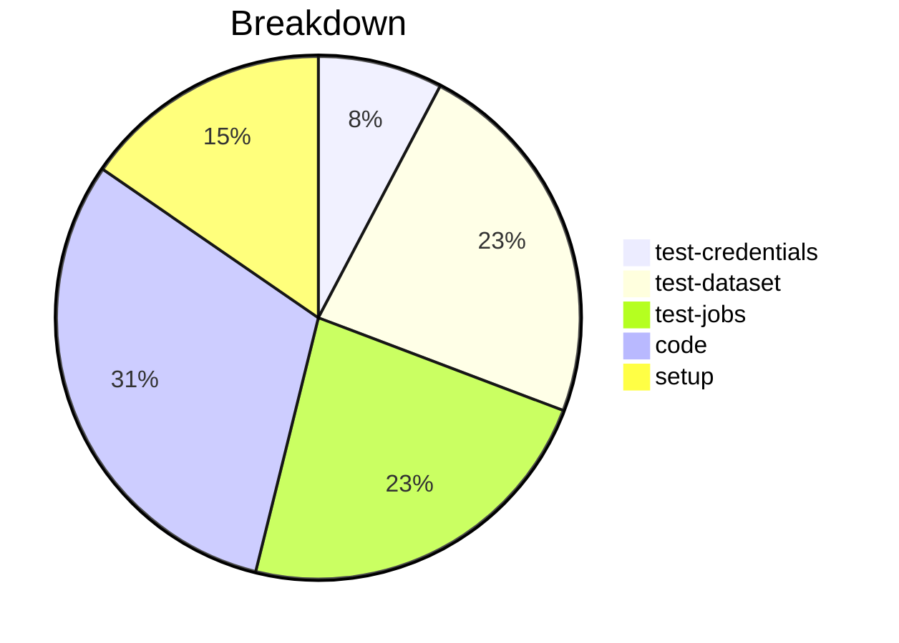

# Status Report

## Week 01

Weekly report for: **Aaditya Sinha**

### What did you do last week?
- Setup Zowe Explorer for VSCode
- Testing my credentials to the mainframe at Marist
- Added method to change the job class in zos_jobs
- Added unit + integeration tests
- Created a PR for issue #182

#### Time (optional)
- test: 1 hour 48 minutes
- code: 2 hour 19 minutes
- setup: 1 hours

### What will you do this week?
- Will continue to work on the issues from z/OSMF Files and Jobs APIs milestones

### Are there any impediments in your way?
- Will be having exam on Saturday, it will be difficult to work on friday
