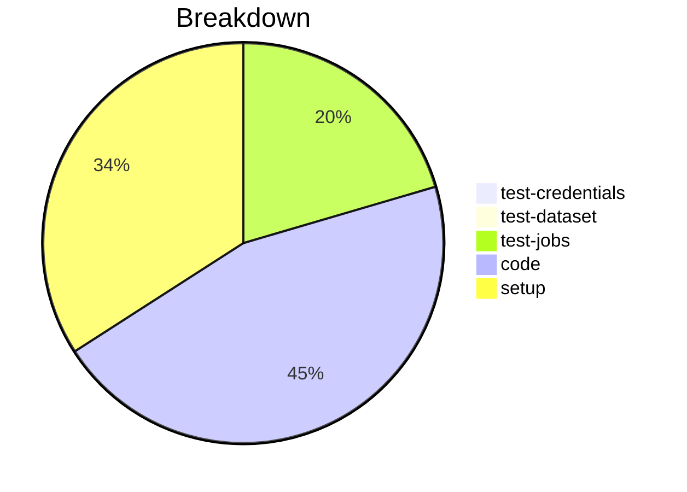

# Status Report

## Week 10

Weekly report for: **Aaditya Sinha**

### What did you do last week?
- Explored the unit test for `validate_schema`
- Fixed the unit test
- Refactored `validate_schema`

#### Time (optional)
- test: 5 hour 5 minutes
- code: 7 hour 52 minutes
- setup: NA

### What will you do this week?
- Complete the unit tests and make PR ready to merge
- Fix the merging order for to match Node.js SDK

### Are there any impediments in your way?
- NA