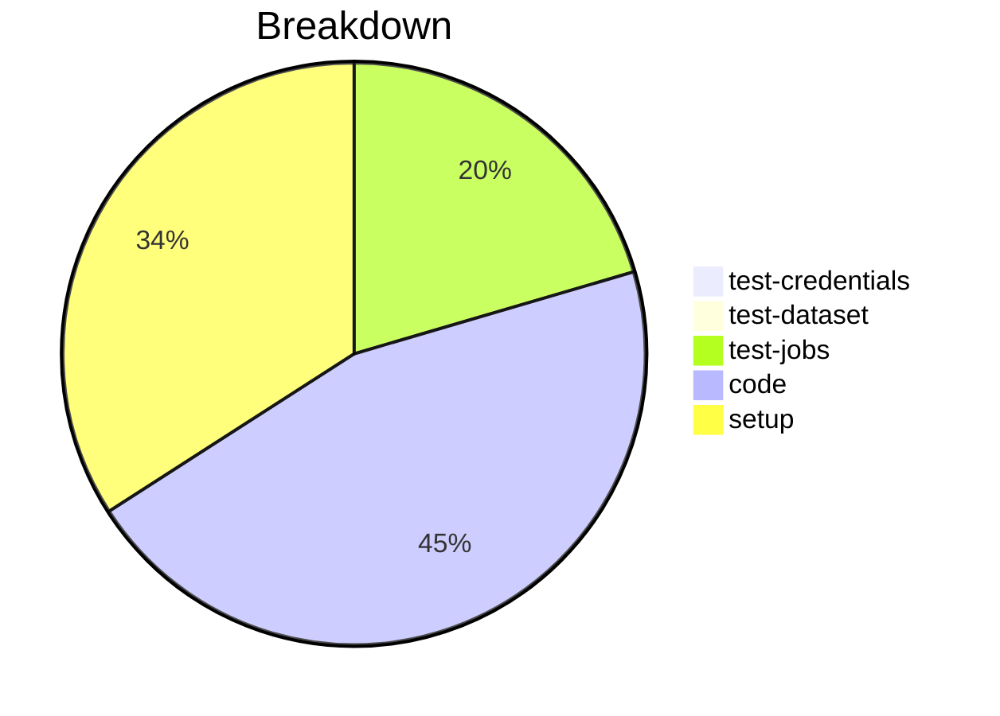

# Status Report

## Week 12

Weekly report for: **Aaditya Sinha**

### What did you do last week?
- Fixed failing tests for `validate_schema`
- Refactored merge order
- Created blog

#### Time (optional)
- test: 5 hour 5 minutes
- code: 7 hour 52 minutes
- setup: NA

### What will you do this week?
- Complete the unit tests and make PR ready to merge

### Are there any impediments in your way?
- NA