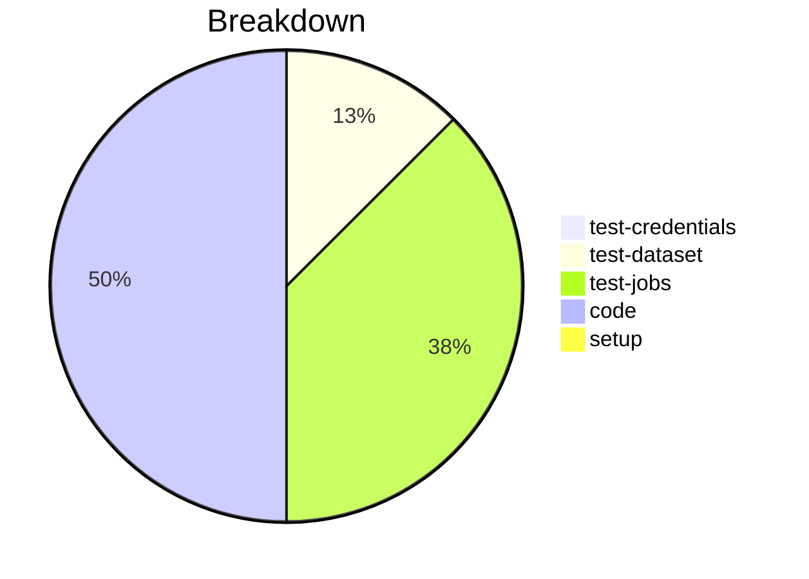

# Status Report

## Week 00

Weekly report for: **Aaditya Sinha**

### What did you do last week?
- Added utility method for hold/release method
- Added unit + integeration tests
- Created a PR for issue #181
- Refactored the method for hold/release

#### Time (optional)
- test: 4 hour 5 minutes
- code: 3 hour 47 minutes
- setup: NA

### What will you do this week?
- Will continue to work on the assigned issues

### Are there any impediments in your way?
- NA