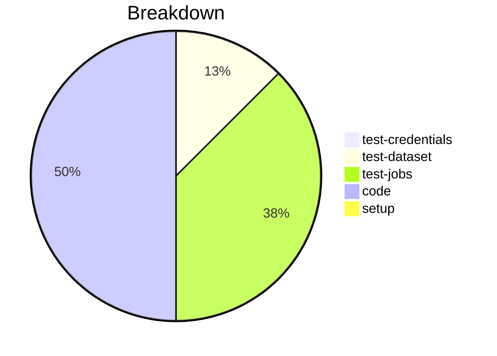

# Status Report

## Week 03

Weekly report for: **Aaditya Sinha**

### What did you do last week?
- Refactored change_class to use utility method
- Fixed tests
- Discussed about Zowe v2 Team Configuration
- Created the project plan

#### Time (optional)
- test: 1 hour 5 minutes
- code: 2 hour 47 minutes
- setup: NA

### What will you do this week?
- Will start working on Validating zowe.config.json file matches schema

### Are there any impediments in your way?
- NA