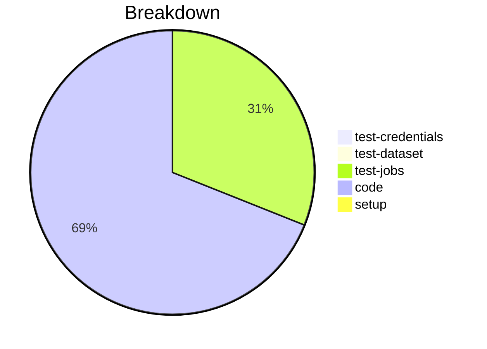

# Status Report

## Week 04

Weekly report for: **Aaditya Sinha**

### What did you do last week?
- Moved the validation logic into the ProfileManager
- Implemented auto_detect and validate the `$schema` property method
- Added validation errors and a getter to search `$schema` property
- Enhanced the `validate_config_json` method to download schema from the internet

#### Time (optional)
- test: 1 hour 5 minutes
- code: 13 hour 24 minutes
- setup: NA

### What will you do this week?
- Will enhance the validation logic more
- Will start implementing the tests

### Are there any impediments in your way?
- NA