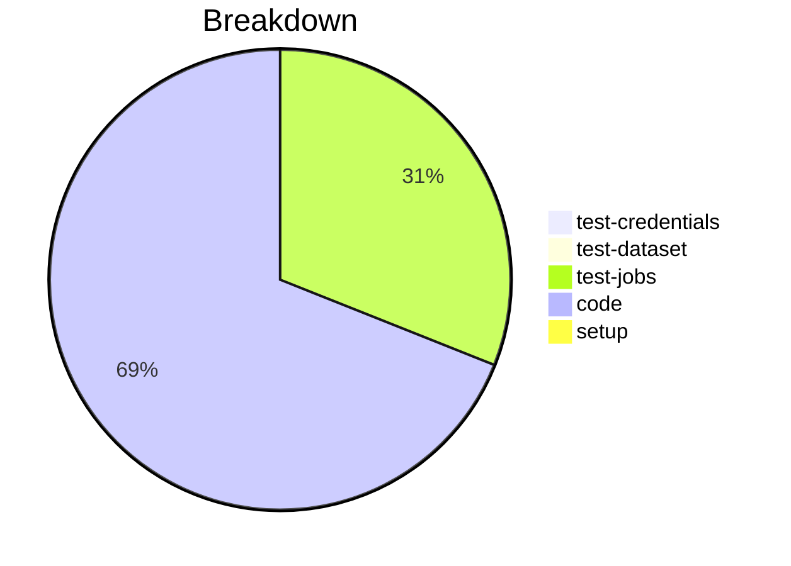

# Status Report

## Week 04

Weekly report for: **Aaditya Sinha**

### What did you do last week?
- Refactored the code and moved `validate_schema` method to `ConfigFile` class
- Fixed the URI check to download `schema` from the internet
- Fixed raising exceptions for validation errors
- Fixed validator if there is no path given

#### Time (optional)
- test: 1 hour 5 minutes
- code: 13 hour 48 minutes
- setup: NA

### What will you do this week?
- Will start working on unit tests

### Are there any impediments in your way?
- NA