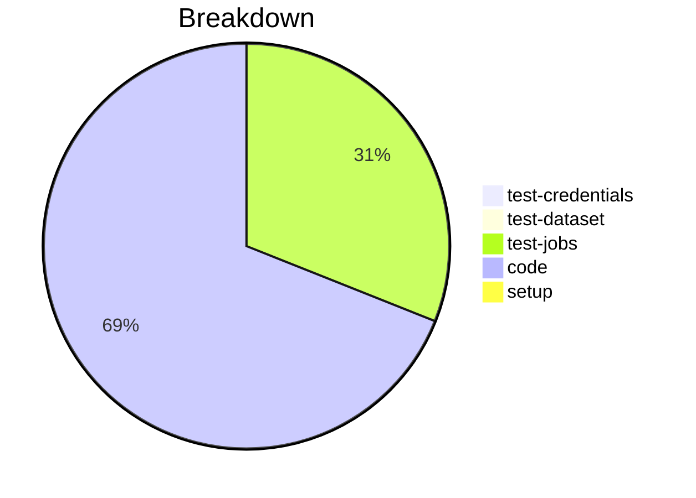

# Status Report

## Week 06

Weekly report for: **Aaditya Sinha**

### What did you do last week?
- Moved the validation log to `init_from_file` to validate schema automatically
- Fixed the tests
- Created the unit test(work in progress)

#### Time (optional)
- test: 2 hour 5 minutes
- code: 15 hour 52 minutes
- setup: NA

### What will you do this week?
- Complete the unit tests for `validate_schema`
- Start working on Load profile properties from environment variables

### Are there any impediments in your way?
- NA