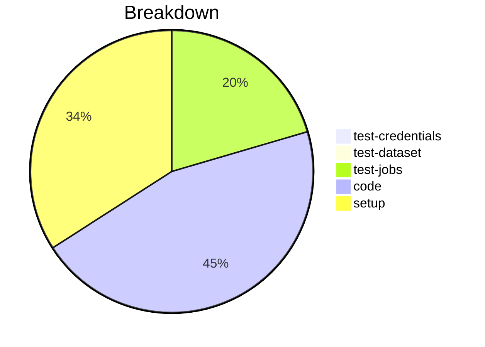

# Status Report

## Week 07

Weekly report for: **Aaditya Sinha**

### What did you do last week?
- Added method in ConfigFile class to return the list of profile properties from the `schema json`
- Added the method in ProfileManager class to get env variables and map them to the profile properties
- Created the unit test for valid schema(work in progress)

#### Time (optional)
- test: 3 hour 5 minutes
- code: 16 hour 52 minutes
- setup: NA

### What will you do this week?
- Complete the unit tests for `invalid schemas`
- Continue working on Load profile properties from environment variables
- Create the unit tests for the `env variables`

### Are there any impediments in your way?
- NA