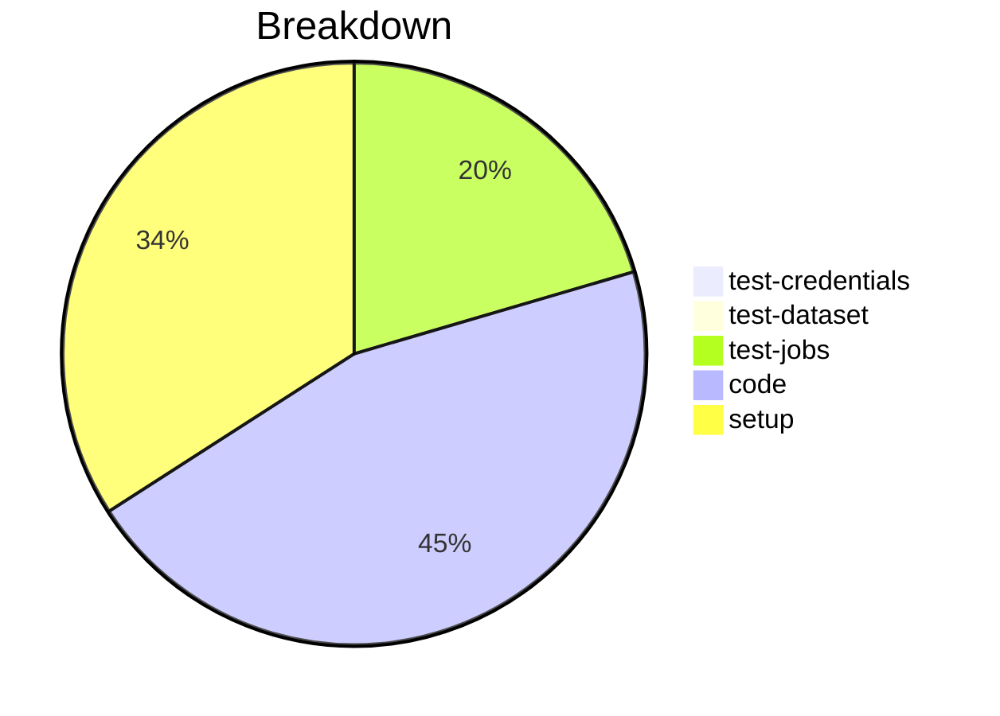

# Status Report

## Week 08

Weekly report for: **Aaditya Sinha**

### What did you do last week?
- Added `opt_out` flag for schema validation
- Added `opt_in` flag for `env` variables
- Created unit test for `env` variables
- Fixed the error to get `schema` json from the fixtures

#### Time (optional)
- test: 3 hour 5 minutes
- code: 16 hour 52 minutes
- setup: NA

### What will you do this week?
- Complete the unit tests for `validate_schema`
- Will start working on "Fix profile merge order to match Node.js SDK"

### Are there any impediments in your way?
- NA