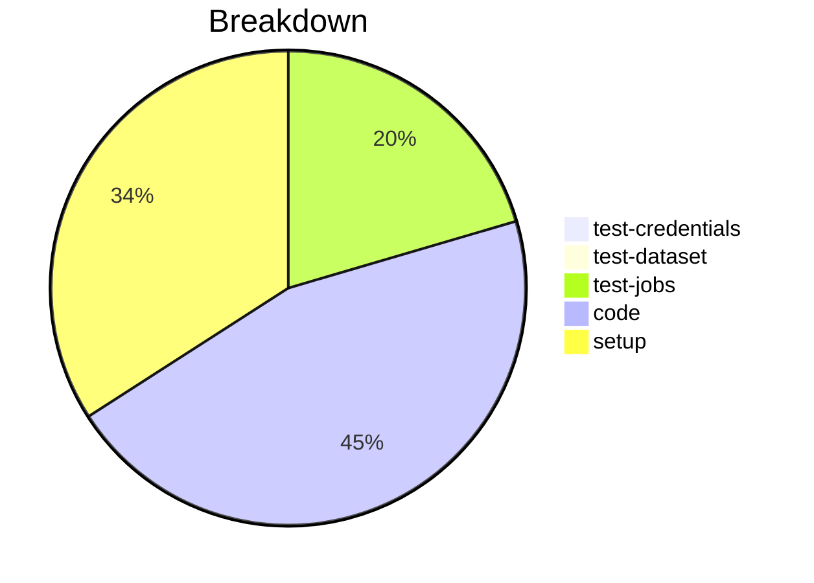

# Status Report

## Week 09

Weekly report for: **Aaditya Sinha**

### What did you do last week?
- Fixed the merging order to load Profile properties
- Fixed the test to load `env_variables`
- Fixed loading the `schema` file

#### Time (optional)
- test: 2 hour 5 minutes
- code: 12 hour 52 minutes
- setup: NA

### What will you do this week?
- Complete the unit tests and make PR ready to merge
- Continue working on "Fix profile merge order to match Node.js SDK"

### Are there any impediments in your way?
- NA