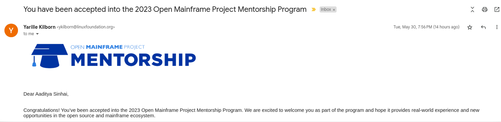
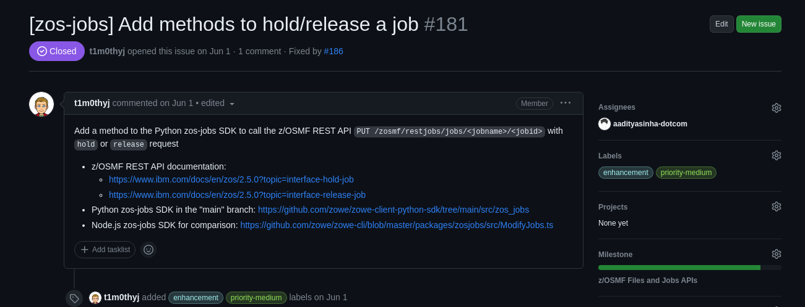

# Mainframe Open Education: My Journey as a Summer Mentee

##### Written by Aaditya Sinha, Open Mainframe Project Summer 2023 Mentee

I am a 3rd year student at Noida Institute of Engineering and Technology, studying Computer Science and Engineering. I am an Open source enthusiast and the community of Open Mainframe Project really looked really interesting to me. I have been contributing to Mainframe project for past 1 and a half years.

## What is the Mainframe Open Education Project?

The MOE Project, as it is called, is open sourcing mainframe education and the transfer of knowledge. The aim is to bridge the skills gap in mainframe technologies. Mainframe professionals use this platform to share their knowledge with the community to ensure that companies that use mainframes have access to new talent. They contribute educational assets, draft learning plans for new talent, and provide business leaders with access to free foundational education. For those who are new to the Mainframe or those who want to learn more about the Mainframe, can also consume. 

## What is Zowe-Python-SDK 🚀:
Zowe is an integrated and extensible open-source framework for z/OS. Similar to popular operating systems like macOS and Windows, Zowe offers a core set of applications combined with APIs and OS capabilities. These components pave the way for future applications to be built upon. Zowe provides modern interfaces to interact with z/OS, allowing a cloud-platform-like experience. The Zowe-Python-SDK specifically enables the creation of client applications and scripts that interface with z/OS REST API interfaces. This SDK empowers Python developers to craft powerful applications for interacting with z/OS components.

## My role as Summer Mentee 🌞:
During my time as a Linux Foundation Mentee, I focused on enhancing the Zowe project. Specifically, I worked on finalizing team configuration support and other enhancements to facilitate a v2 release. This included adding support for Zowe v2 team configuration. I tackled various issues, such as:

## My acceptance into the programme
“zowe-client-python-sdk” which was a set of Python packages designed to allow programmatic interactions with z/OS REST API interfaces with minimum effort.

It's 2022, I started contributing to it. 3–4 PRs of mine also got merged in the repo. I also talked with mentor about the issues/PRs related stuffs. Then by the time I was contributing in the last week of May the deadline the mentorship program was close. So I immediately submitted the requirements which were needed to apply resume, enrollment verification and a cover letter containing answers to the questions asked. After few weeks I didn’t get any email from organization and the mentorship program was about to start. Then I checked to mentorship page and saw that the mentees were already get selected. I was shocked and dissappointed of course.

I was too late to apply, they wanted to select mentees a week before I submitted
I was only lacking in experience as I was only in second year, I didn’t have much of experience or any projects in python
This helped me so much, I continued contributing to the repository until next year that 2023. I also got an internship in python development in the mean time. Made some python projects also and some pretty good contributions.

Now, its 2023. The time has come, I was working on a PR and did some meetings with Timothy. It was a pending PR though. My exams was starting so put it on hold. The applications were opened as Timothy said in one of our call. Then I said “okay, I will definitely apply this time”. I submitted my resume which was pretty good than the last time, enrollment identification and cover letter.

I was pretty nervous. Everyday I look into my gmail. Then one day I was studying for my exam and suddenly a notification popped up. I opened it and saw the acceptance mail for the mentorship program. Yay!! Finally my work paid off.

## What did I do for 3 months?
My main task was to enhance zowe-python-client-sdk for version 2 by adding features which were already in node.js sdk and add z/OSMF Files and Jobs Api.

For first month I was assigned with some good first issues to add zos-files and zos-jobs api.

I learned a lot from these issues, how we can make the use of utility method, how to create tests which can test more than one method.

After one and half month I was assigned with Zowe v2 Configuration which were having the core features for the python-sdk.
I was working on 3 main issues with priority medium and high.
It was great experience learning a lot about zowe-cli and how to work on complex project. I also learned that unit tests are important part of software engineering.

At last week I was able to complete all the tasks and making all the PRs ready to merge.

## Should you apply for LFX Mentorship Programme too?
Are you interested in Open Source? Then, a Simple answer — Yes! Definitely try applying for the programme.

I am glad that I got this opportunity and have learnt a lot during the span of 3 months. I think it’s a really cool opportunity that you personally get mentored by amazing engineers who build tools to solve problems. Some perks of participating in the LFX Mentorship Programme include:

1. Learning: Being a newbie to the world of DevOps, I certainly have gained a lot of knowledge by exploring and working alongside the people

2. Networking: This is one of the under-rated perks of any Open Source Programmes. Networking and interacting with the community improves one’s soft skills and promotes growth when you hear different views, opinions, and approach on solving a problem.

3. Stipend: Who does not love a stipend while learning 😉, the LFX Mentorship Programme pays a great stipend, but I would really advise participating in this programme not for the stipend but for the above points.

Overall my journey has been a great experience and I would like to thank my mentors Timothy Johnson and Frenendo(such a great mentors) for guiding me throughout the mentorship, I would like to thank the community that’s always active and helps for the betterment of such tools 😃.

This summarized my journey as a Linux Foundation’s Zowe Mentee and I hope this blog was informative.