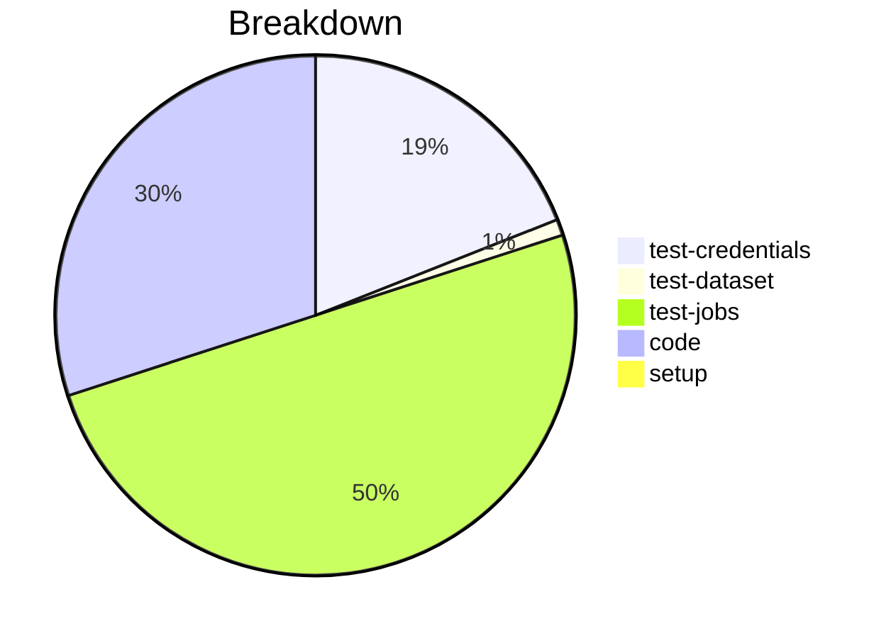

# Status Report

## Week 10

Weekly report for: **Abdul Samad**

### What did you do last week?
- updated the implementation of the `load_secure_props`
- modified the logic `_retrieve_password ` & `set_secure_props` method
- added unit test covering all possible cases

#### Time (optional)
- test: 10 hour
- code: 5 hour
- setup: NA

### What will you do this week?
- will add unit test for issue #73 & #72 

### Are there any impediments in your way?
- NA
