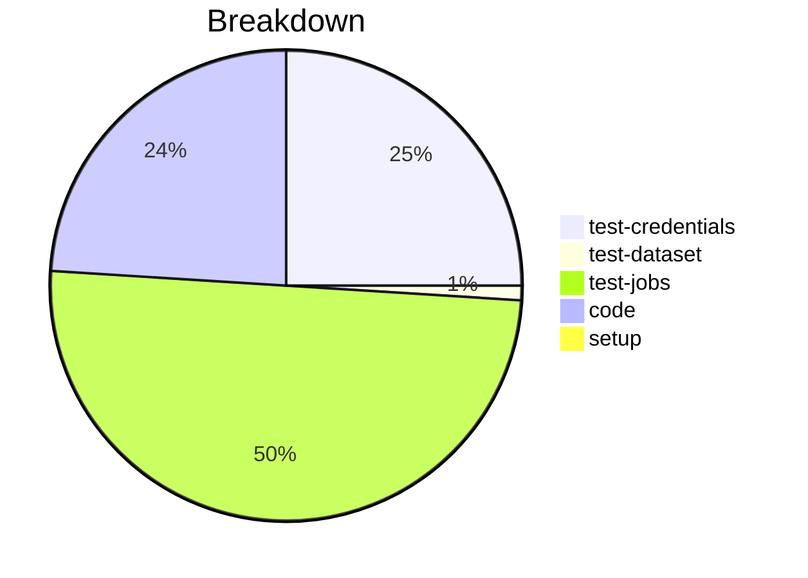

# Status Report

## Week 12

Weekly report for: **Abdul Samad**

### What did you do last week?
- updated the implementation of the `ProfileManager.set_profile()`,`ProfileManager.get_highest_priority_layer()`, `ConfigFile.set_profile()`, `ConfigFile.set_property()`
- modified the logic `_retrieve_password ` & `setUpCred()` method
- added unit test covering all possible cases

#### Time (optional)
- test: 10 hour
- code: 9 hour
- setup: NA

### What will you do this week?
- I will address comments and reviews if any are received on the pull requests.
### Are there any impediments in your way?
- NA
