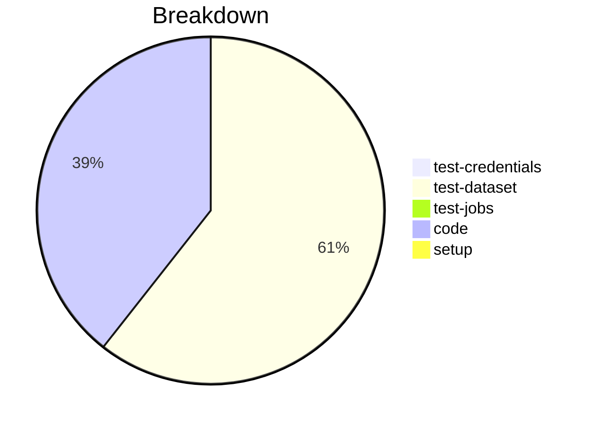

# Status Report

## Week 02

Weekly report for: **Abdul Samad Siddiqui**

### What did you do last week?
- Updated `list_dsn` to return attributes
- Added unit test of `list_dsn` method
- update integeration test of `list_dsn` method
- Refactor code to address comments on both pull requests [#188](https://github.com/zowe/zowe-client-python-sdk/pull/188) & [#184](https://github.com/zowe/zowe-client-python-sdk/pull/184)
- Created a PR for issue [#117](https://github.com/zowe/zowe-client-python-sdk/pull/188)

#### Time (optional)
- test: 1 hour
- code: 30 minutes  

### What will you do this week?
- Will continue to work on the issues from z/OSMF Files and Jobs APIs milestones

### Are there any impediments in your way?
- NA
