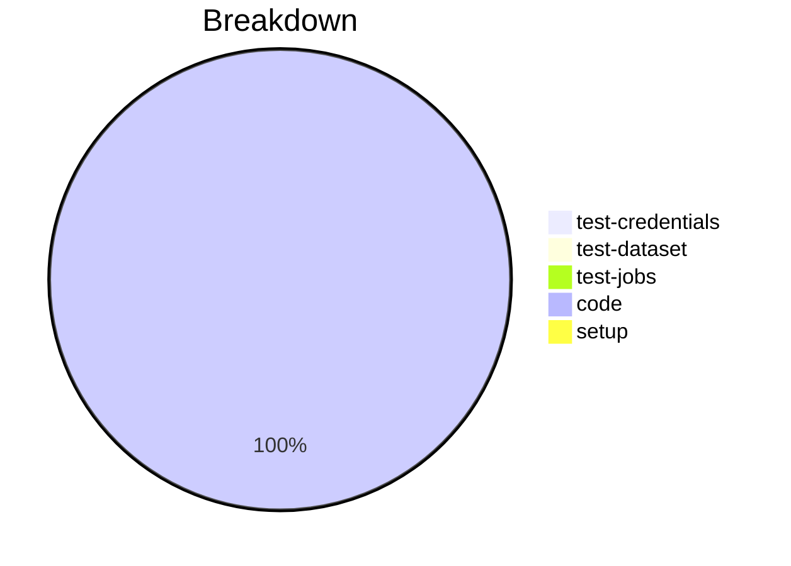

# Status Report

## Week 04

Weekly report for: **AbdulSamad**

### What did you do last week?
- Implementws secure value loading method for multiple Windows credentials
- Modified implementation of the `load_secure_props`
- Added `_retrieve_password ` & `set_secure_props` method

#### Time (optional)
- test: 4 hour
- code: 14 hour
- setup: NA

### What will you do this week?
- Will enhance the validation logic more
- Will start implementing the tests

### Are there any impediments in your way?
- NA
