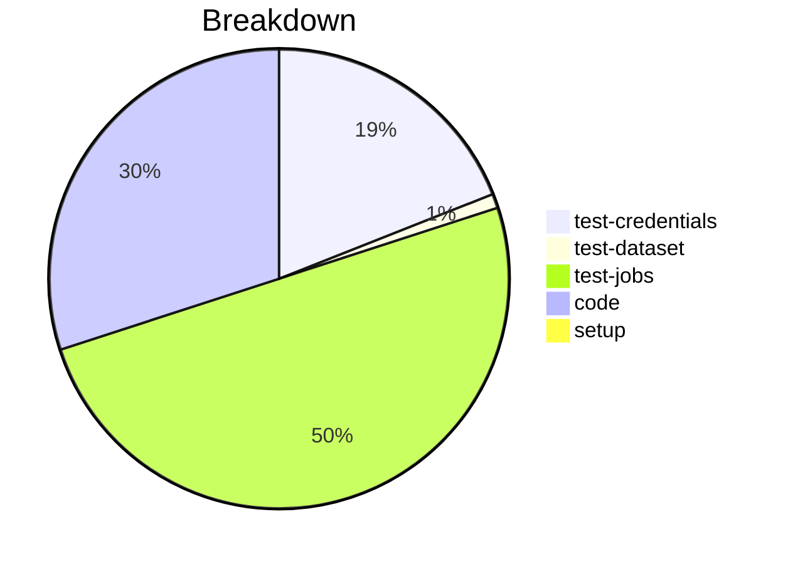

# Status Report

## Week 05

Weekly report for: **Abdul Samad**

### What did you do last week?
- Implementws secure value loading method for multiple Windows credentials
- updated the implementation of the `load_secure_props`
- modified the logic `_retrieve_password ` & `set_secure_props` method
- added unit test covering all possible cases

#### Time (optional)
- test: 8 hour
- code: 10 hour
- setup: NA

### What will you do this week?
- will be on break for the upcoming week from July 10th to July 15th for exams.

### Are there any impediments in your way?
- Final exams
