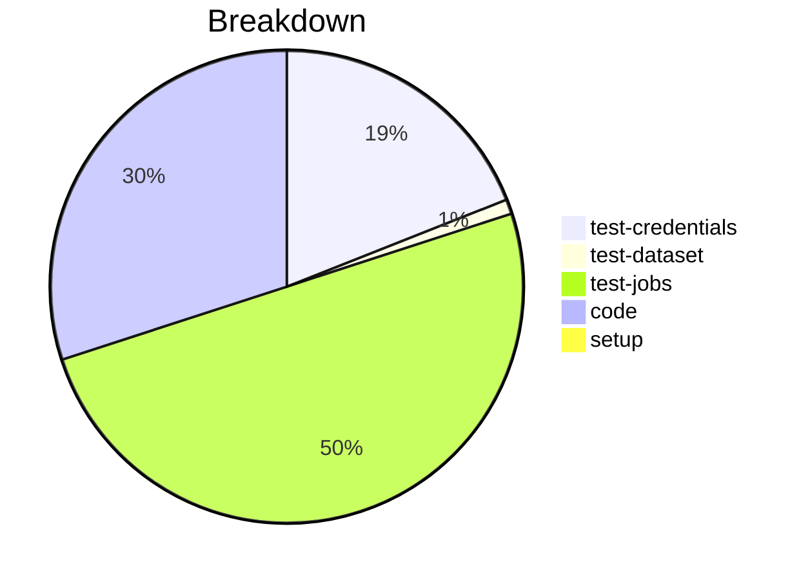

# Status Report

## Week 08

Weekly report for: **Abdul Samad**

### What did you do last week?
- added `ProfileManager.set_property()`, `ConfigFile.set_property()` , `__is_secure` and `get_highest_priority_layer()` method 
- test all possible cases
- addressed the comment

#### Time (optional)
- test: 12 hour
- code: 10 hour
- setup: NA

### What will you do this week?
- will be working on #73

### Are there any impediments in your way?
- NA
