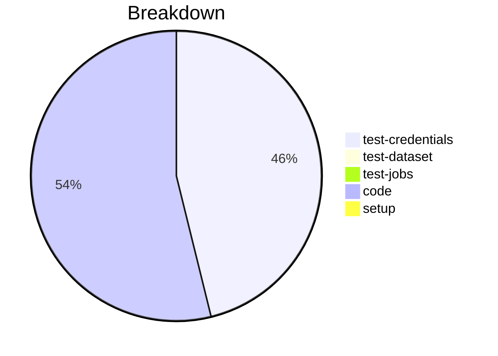

# Status Report

## Week 09

Weekly report for: **Abdul Samad**

### What did you do last week?
- Created a `CredentialManager` class and added `load_secure_props()`, `_retrieve_credential()`, `delete_credential()`, and `save_secure_props` methods.
- Added the `set_profile()` & `ProfileManager.save()` method.
- Tested all possible cases.
- Addressed the comment.

#### Time (optional)
- test: 15 hour
- code: 16 hour
- setup: NA

### What will you do this week?
- I will start working on issue #72 and complete the unit test of #73 and #134.

### Are there any impediments in your way?
- NA
