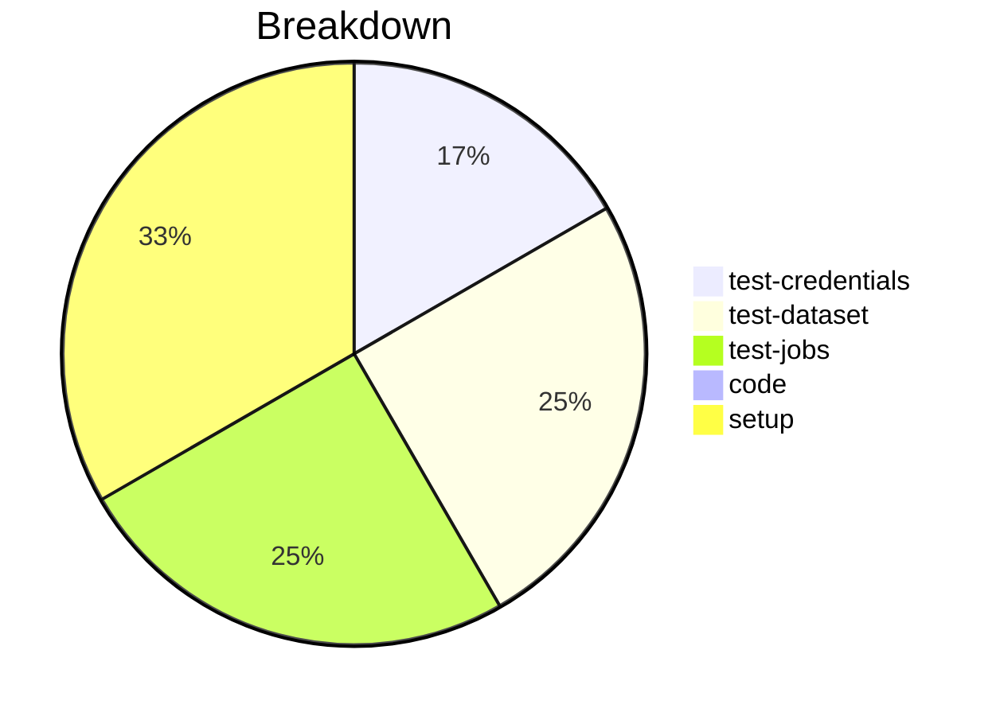

# Status Report

## Week 00

Weekly report for: **YOUR_NAME_HERE**

### What did you do last week?
- Setup Zowe Explorer for VSCode
- Testing my credentials to the mainframe at Marist
- Testing Data Set functionality
- Testing JES Jobs functionality

#### Time (optional)
- test: 2 hour
- code: 0 hours
- setup: 1 hours

### What will you do this week?
- Continue working on: #148

### Are there any impediments in your way?
- I'm unable to get 100% coverage for my new function